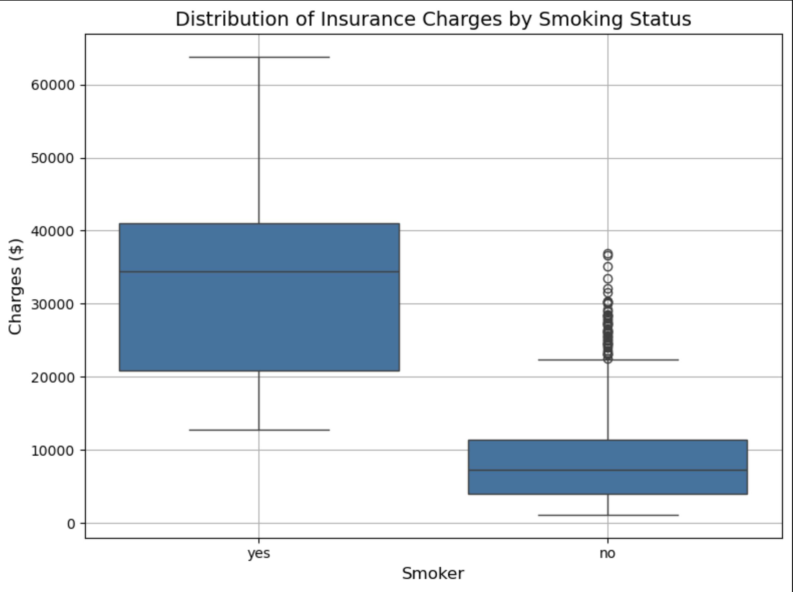
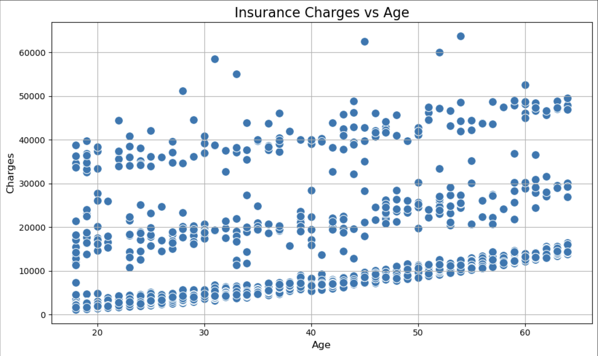

# Predicting Medical Insurance Costs in the U.S.

### Objective
This project explores the **US Medical Insurance Costs** dataset to understand the factors that influence individual healthcare charges. The goal is to uncover patterns, visualize relationships, and build predictive models that estimate insurance costs based on personal attributes.

### Dataset Overview
The dataset contains demographic and health-related information for individuals, including:
- `age`: Age of the individual
- `sex`: Gender (male/female)
- `bmi`: Body Mass Index
- `children`: Number of dependent children
- `smoker`: Smoking status (yes/no)
- `region`: Residential region in the U.S.
- `charges`: Medical insurance cost billed to the individual

### Expected Outcomes
- Identify key drivers of insurance charges
- Quantify the impact of smoking, number of children, gender, and age on cost
- Present insights through visualizations and summary statistics

---

<h2> Final Visualization</h2>

<strong>Insurance Charges By Smoking Status</strong>

<strong>Insurance Charges By Age</strong>

## Python Version and Library Dependencies
- Python (3.12.7)
- matplotlib==3.9.2
- csv==1.0
- seaborn==0.13.2
