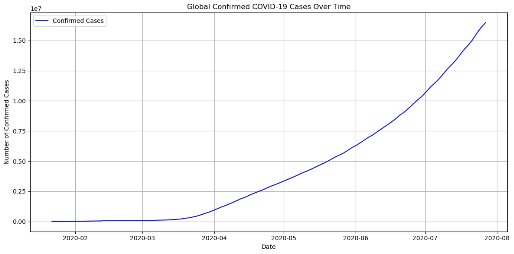
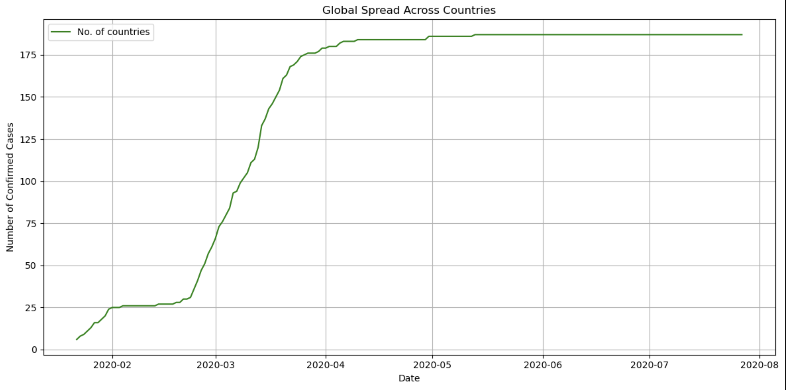
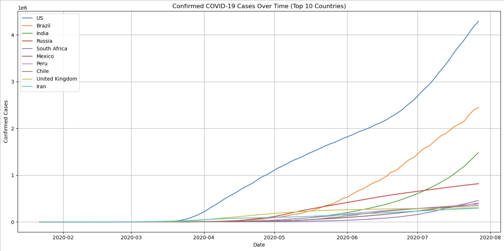
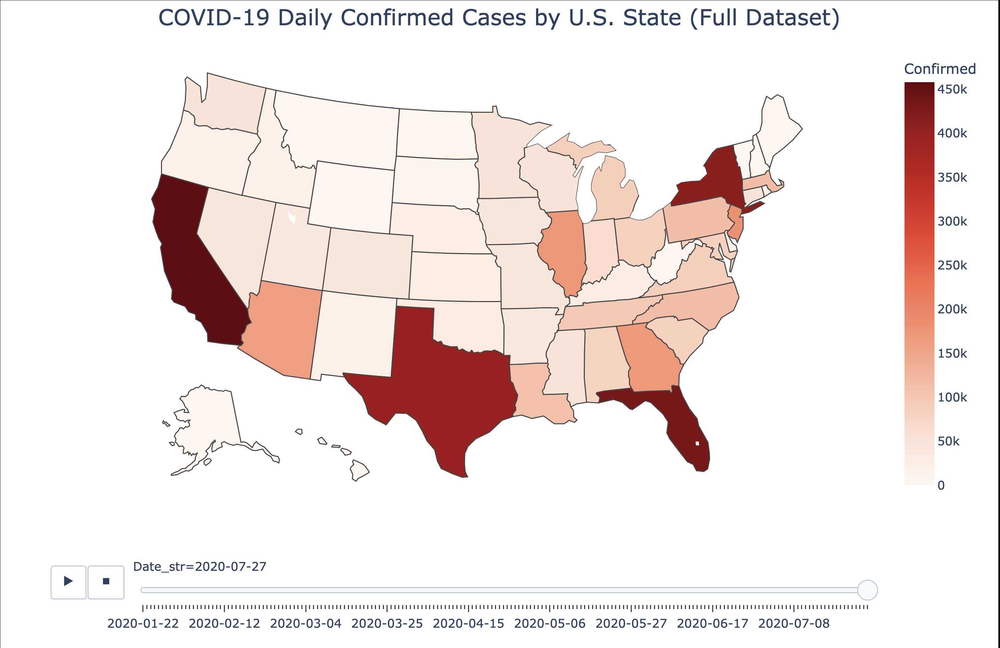

# COVID-19 Pandemic Trends — Data Science Portfolio Project

## Project Overview

The COVID-19 pandemic, caused by the SARS-CoV-2 virus, reshaped global life since its emergence in late 2019. In this project, I apply data science techniques to explore its spread, analyze trends, and uncover insights that supported public health awareness and strategic decision-making in 2020.

This notebook uses publicly available datasets from Kaggle to investigate COVID-19 case progression across both the world and the United States. We focus on metrics such as confirmed cases, deaths, and recoveries, with special attention to time-based trends and geographic comparisons.

## Dataset Details

- **Source**: Kaggle COVID-19 datasets (specific link and file name to be inserted)
- **Scope**: Global and US-specific data
- **Key Variables**: `Date`, `Country/Region`, `State`, `Confirmed`, `Deaths`, `Recovered`

## Project Goals

This analysis aims to answer critical questions at both global and national levels, using visualizations and aggregated statistics to narrate the pandemic’s evolution.

### Global Analysis

1. **Worldwide Trend: Global Confirmed Cases Over Time**  

2. **Visualizing the Global Spread**  

3. **Top 10 Countries with the Most Confirmed Cases**  

4. **Confirmed Cases Over Time — Top 10 Countries**  

5. **Top 10 Countries with the Highest Death Rates**  

6. **Top 10 Countries with the Highest Recovery Rates**  

### United States Analysis

1. **Top 10 States with the Most Confirmed COVID-19 Cases**  

2. **Accumulated Confirmed Cases (Jan–Jul 2020)**  

3. **Nationwide Spread of Confirmed Cases Over Time**  

---

<h2> Final Visualization</h2>

<strong>Global Confirmed Cases Over Time</strong>

<strong>Global Spread Across Countries</strong>

<strong>Top10 Countries With Most Confirmed Cases</strong>

<strong>Most Confimed Cases In The US Animated Heat-Map</strong>

## Python Version and Library Dependencies
- Python (3.12.7)
- matplotlib==3.9.2
- pandas==2.2.2
- us==3.2.0
