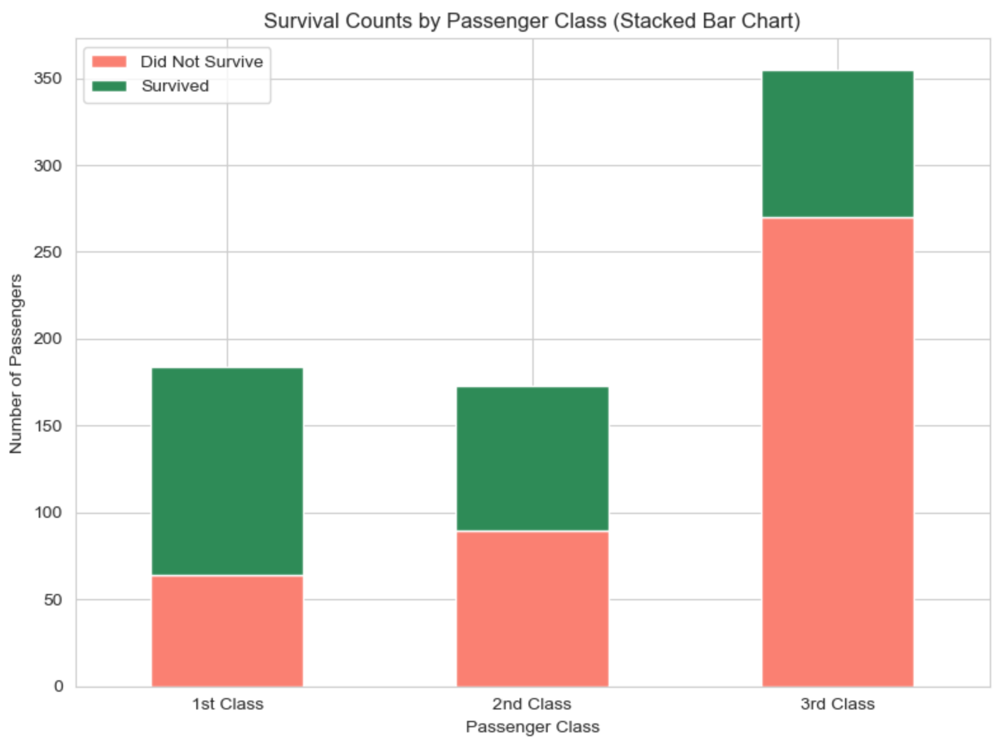
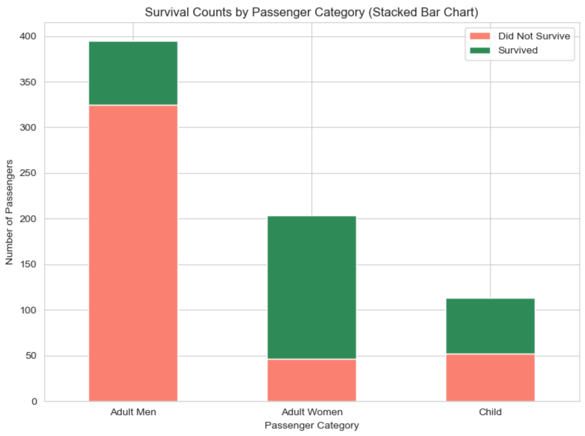
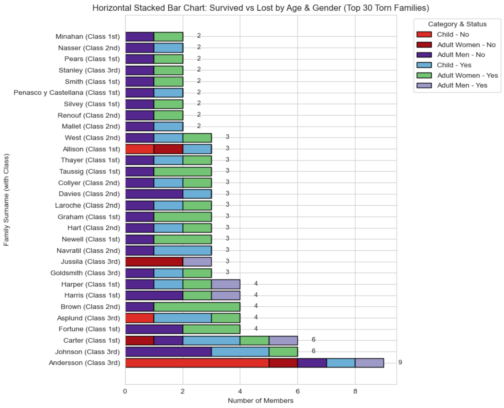

# **Survival Rate of Passengers of the RMS Titanic in 1912 – A Data Visualization Portfolio Project**  

The sinking of the RMS Titanic in 1912 remains one of history’s most tragic maritime disasters. Though deemed unsinkable, the ship was ill-prepared for an emergency, lacking sufficient lifeboats and a trained crew capable of managing an orderly evacuation. This failure contributed to a devastating loss of life, disproportionately affecting certain passenger groups.  

This project analyzes the survival rate of Titanic passengers, using historical data to uncover patterns in demographics, ticket class, and other factors that influenced survival outcomes. Through data visualization, I explore key questions such as:  

- What was the age distribution of the passengers onboard?  
- From which port did they embark?  
- How many passengers were in each class, and what was the average fare?  
- What were the survival rates based on age, gender, and class?  
- How do survival rates align with historical accounts of the disaster?  
- Which families were torn apart by this tragedy?  

By transforming raw data into meaningful insights, this project brings a new perspective to the human stories behind the numbers.  

## Data: 
The 'dataset' was taken from Kaggle which was suppose to be used for machine learning project but used the training data set for data Visualization.

## Conclusion: 
To conclude, the results highlight how survival was shaped not just by chance, but by decisions influenced by age and gender during the tragedy.

Women and children had significantly higher chances of survival compared to men. Calculations reveal that a large proportion of female passengers and younger individuals were rescued, while the majority of adult males did not survive. These figures reflect the "women and children first" evacuation approach that was followed on board.

<h2>📊 Final Visualization</h2>

<strong>Survival by Class</strong>

<strong>Survival by Category</strong>

<strong>Survival vs Lost by Age and Gender</strong>

## Python Version and Library Dependencies
- Python (3.12.7)
- matplotlib==3.9.2
- pandas==2.2.2
- seaborn==0.13.2
